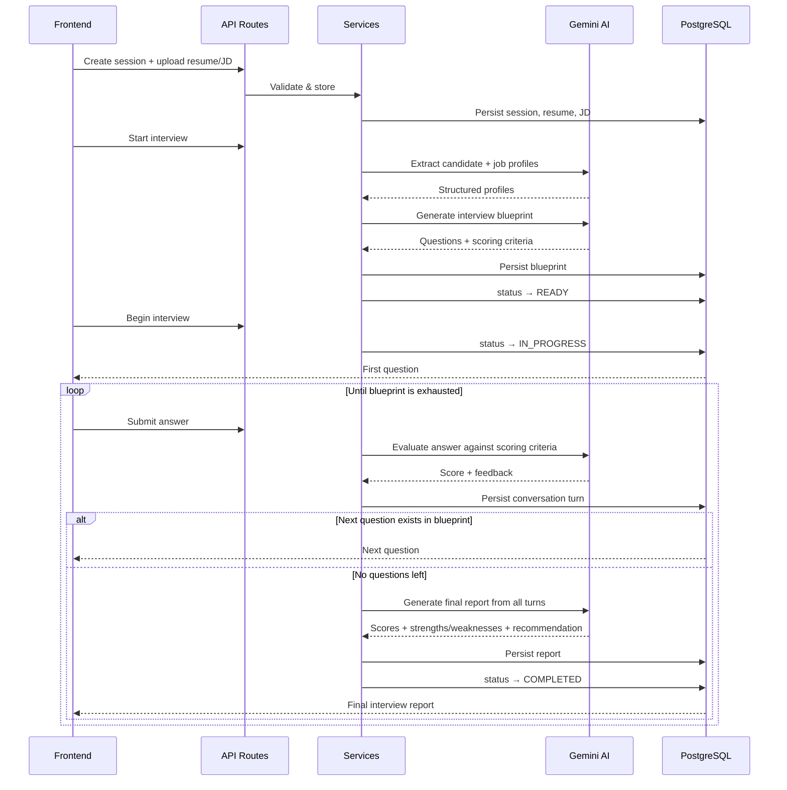
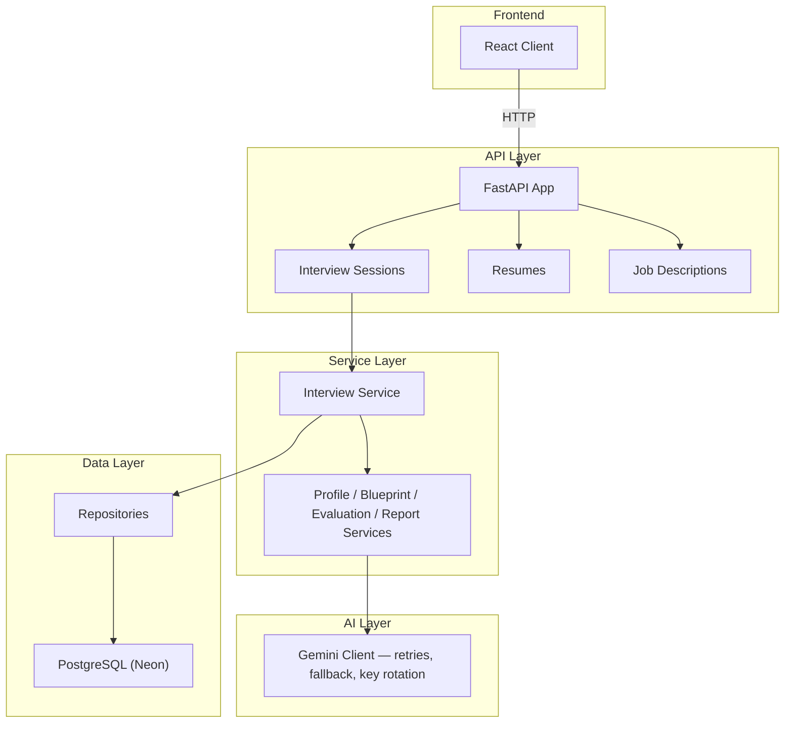
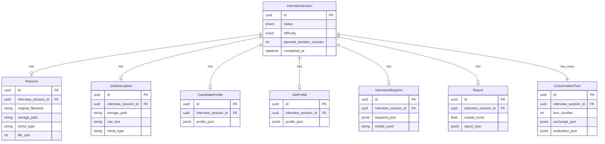

# AiiN — AI-Powered Mock Interview Platform

AiiN turns a resume and a job description into a full, adaptive mock interview — conducted and scored end-to-end by AI. Upload the two documents, and the system builds a candidate profile, generates a tailored interview blueprint, runs the interview question-by-question, evaluates each answer in real time, and produces a final scored report with recommendations.

**Stack:** FastAPI · PostgreSQL (Neon) · SQLAlchemy · Google Gemini · React

---

## Why This Project

Most "AI interview" tools ask generic questions. AiiN builds the interview *from the actual resume and job description* — every question is grounded in the candidate's real background and the role's real requirements, and every evaluation accounts for how the answer was given (including tolerating speech-to-text transcription artifacts, e.g. "UART" transcribed as "you are tea," so candidates aren't penalized for STT noise).

---

## How It Works

1. **Upload** — candidate submits a resume (PDF/DOCX) and a job description
2. **Parse** — text is extracted and sent to Gemini to build structured `CandidateProfile` and `JobProfile` objects
3. **Blueprint** — Gemini generates a full interview blueprint: sections, questions, and scoring criteria, tailored to the candidate–role match
4. **Interview loop** — a single endpoint (`POST /{id}/answer`) drives the whole interview:
   - The submitted answer is evaluated against that question's scoring criteria
   - The turn (question, answer, evaluation) is persisted
   - The service checks the blueprint for a next question:
     - **If one exists**, it's returned immediately, the candidate keeps going
     - **If none is left**, the same call triggers report generation instead: Gemini synthesizes the final report from every turn, the session is marked `COMPLETED`, and the report is returned in place of a next question
   - This means there's no separate "end interview" step, the last answer and the report come back in one response



---

## Architecture

Layered architecture: routes stay thin, all business logic lives in services, all SQL is isolated in a repository layer.



**Interview state machine:**
`CREATED → PARSING → READY → IN_PROGRESS → COMPLETED` (with a `FAILED` branch on error)

---

## Key Engineering Decisions

| Decision | Why |
|---|---|
| **Structured AI output** (`response_schema` on every Gemini call) | Every AI response is validated against a Pydantic schema — no brittle regex parsing of free-form text |
| **Model + key fallback chain** in the Gemini client | Retries with exponential backoff, falls back across models (`gemini-3.6-flash` → `gemini-3.5-flash` → `gemini-3.1-flash-lite`), and alternates API keys to survive rate limits and 503s |
| **Repository pattern** | All SQL isolated from business logic — services never touch the DB directly |
| **State machine on interview status** | Prevents invalid transitions (e.g. can't submit an answer to a completed interview) |
| **STT-aware evaluation prompt** | Answer scoring explicitly discounts transcription artifacts instead of penalizing candidates for them |

---

## API Overview

All endpoints are under `/api/v1/interview-sessions`.

| Method | Endpoint | Purpose |
|---|---|---|
| `POST` | `/` | Create a new interview session (difficulty + duration) |
| `POST` | `/{id}/resume` | Upload resume |
| `POST` | `/{id}/job-description` | Upload job description |
| `POST` | `/{id}/start` | Parse documents, generate profiles + blueprint |
| `POST` | `/{id}/begin` | Begin the interview loop, get first question |
| `POST` | `/{id}/answer` | Submit an answer, get evaluation + next question (or final report) |

---
## Project Structure

```text
app/
├── main.py                  # FastAPI app & router registration
├── core/                    # Configuration & enums
├── db/                      # Database setup & dependencies
├── models/                  # SQLAlchemy database models
├── schemas/                 # Pydantic request/response schemas
├── repositories/            # Database queries & CRUD
├── services/                # Business logic
├── ai/                      # Gemini/LLM integration
└── utils/                   # Utility functions

---

## Data Model

Every entity hangs off a central `InterviewSession`, which tracks the interview's state machine (`status`, `difficulty`, `planned_duration_minutes`, `completed_at`). Every child table inherits `id`, `created_at`, `updated_at` from `BaseModel` on top of what's shown below.



Design notes worth calling out to an interviewer:
- **`CandidateProfile`, `JobProfile`, `InterviewBlueprint`, and `Report` all store their AI output as `jsonb`** rather than being normalized into columns — the shape of an AI-generated profile or blueprint can evolve without a migration, and Postgres's `jsonb` still lets you index/query into it if needed later.
- **`InterviewBlueprint.model_used` is tracked per row** — since the Gemini client falls back across models, you always know which model actually generated a given interview's questions.
- **`ConversationTurn` stores both `exchange_json` and `evaluation_json` separately** — the raw Q&A exchange is kept distinct from the AI's scoring of it, so re-evaluating an answer later wouldn't require re-storing the exchange.

---

## Getting Started

```bash
# clone and install
git clone https://github.com/Saad-V/ai-interview-platform.git
cd ai-interview-platform
pip install -r requirements.txt

# configure environment
cp .env.example .env
# set DATABASE_URL, GEMINI_API_KEY, GEMINI_API_KEY_2

# run
uvicorn app.main:app --reload
```

API docs are auto-generated by FastAPI at `/docs` once the server is running.

---

## Tech Stack

- **Backend:** FastAPI, SQLAlchemy, Pydantic / Pydantic Settings
- **Database:** PostgreSQL (hosted on Neon)
- **AI:** Google Gemini (structured output via `response_schema`)
- **Document parsing:** PyMuPDF (PDF), python-docx (DOCX)
- **Frontend:** React

---

Author
V Muhammed Saad Sabeel
